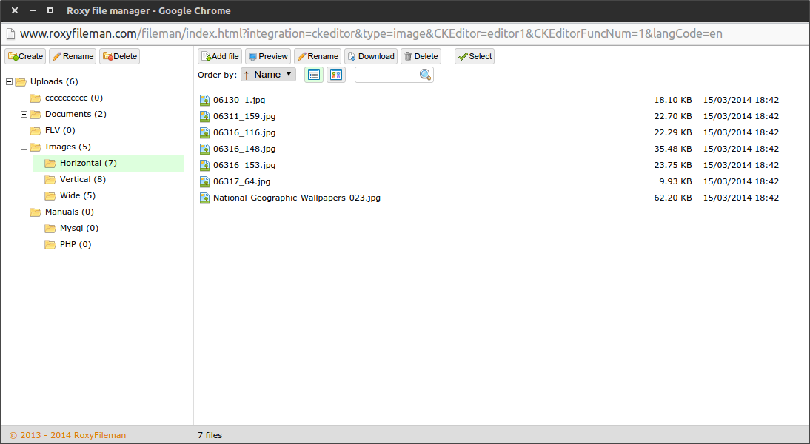

# Roxy Fileman for Django

Roxy Fileman is free open source file browser for .NET and PHP, ready for use with
CKEditor and TinyMCE WYSIWYG html editors. It could be easily integrated into a
CMS or any other web application. Supported browsersFileman is based on JQuery and
JQueryUI libraries and it's compatible with all modern browsers — Internet
Explorer, Firefox, Google Chrome, Safary and Opera.



*   http://www.roxyfileman.com/
*   Used version: 1.4.1

## Installation

1.  Run the command:
    
    ```
    $ pip install django-roxyfileman
    ```

2. Add application into your `INSTALLED_APPS` config:

    ```
    INSTALLED_APPS = [
        ...,
        'roxyfileman',
    ]
    ```

3. Bind url to application in `urls.py`:

    ```
    urlpatterns = patterns('',
        ...,
        url('^roxyfileman/', include('roxyfileman.urls')),
    )
    ```

## Integrate with CKEditor

If you use [django-ckeditor-updated][1], you can integrate Roxy Fileman with
your editor. Add this in your config file:

```
CKEDITOR_CONFIGS = {
    'default': {
        'filebrowserBrowseUrl': '/roxyfileman/',
    }
}

ROXY_INTEGRATION = 'ckeditor'
```


[1]: /django-ckeditor/django-ckeditor
